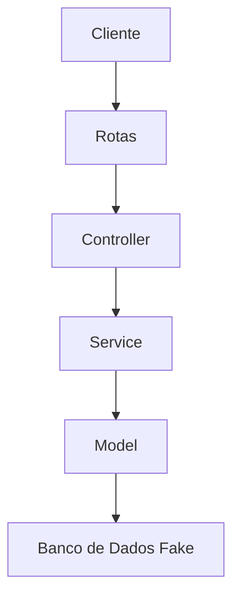

Documentação da API de Gerenciamento de Tarefas

Introdução:  
Esta API foi desenvolvida para permitir o gerenciamento completo de tarefas, seguindo os princípios RESTful e a arquitetura MVC. Ela inclui funcionalidades avançadas como validação de dados, filtragem inteligente e tratamento de erros personalizados, sendo ideal para integração com frontends web/mobile.

---

Funcionalidades Principais 
1. CRUD Completo:
   - Criação, leitura, atualização e exclusão de tarefas  
   - ID único automático para cada registro (UUID v4)  

2. Validação Rigorosa:  
   - Título: mínimo 3 caracteres  
   - Descrição: campo obrigatório  
   - Status: booleano (`concluida`)  

3. Filtros Avançados:
   - Listagem filtrada por status de conclusão  
   - Busca específica por ID da tarefa  

4. Arquitetura Organizada:
   - Separação clara entre lógica de negócio (Service), rotas (Controller) e dados (Model)  
   - Middlewares dedicados para validação e tratamento de erros  

---

 Instalação e Execução

 Pré-requisitos  
- Node.js (versão 18 ou superior)  
- NPM (Gerenciador de pacotes)  

Passo a Passo  
```bash
# 1. Clonar repositório
git clone https://github.com/LandonNicolas/api-tarefas.git

# 2. Acessar diretório
cd api-tarefas

# 3. Instalar dependências
npm install

# 4. Iniciar servidor
npm start
```

Acesso: 
- Servidor disponível em: `http://localhost:3000`  
- Endpoints base: `/tarefas`  

---

Detalhamento dos Endpoints

1. Listar Tarefas (`GET /tarefas`)  
Parâmetros Query:  
- `concluida`: Filtra por status (true/false)  

Exemplo de Requisição:  
```http
GET /tarefas?concluida=true
```

Resposta de Sucesso (200 OK): 
```json
[
  {
    "id": "a1b2c3d4",
    "titulo": "Revisar código",
    "descricao": "Verificar validações Joi",
    "concluida": true
  }
]
```

---

2. Criar Tarefa (`POST /tarefas`)  
Corpo da Requisição (JSON): 
```json
{
  "titulo": "Estudar arquitetura MVC",
  "descricao": "Praticar com projeto Node.js"
}
```

Resposta de Sucesso (201 Created):
```json
{
  "id": "e5f6g7h8",
  "titulo": "Estudar arquitetura MVC",
  "descricao": "Praticar com projeto Node.js",
  "concluida": false
}
```

Erros Comuns:
- `400 Bad Request`: Dados inválidos ou campos faltantes  
- `500 Internal Server Error`: Erro no servidor  

---

 3. Atualização Parcial (`PATCH /tarefas/:id/concluir`)  
Exemplo de Requisição: 
```http
PATCH /tarefas/a1b2c3d4/concluir
```

Resposta de Sucesso (200 OK): 
```json
{
  "mensagem": "Tarefa marcada como concluída",
  "tarefa": {
    "id": "a1b2c3d4",
    "concluida": true
  }
}
```

---

Arquitetura do Sistema 

 Diagrama de Componentes  


Fluxo de Requisição:  
1. Cliente→ Envia requisição HTTP  
2. Rotas → Direciona para o Controller adequado  
3. Controller → Valida dados e chama Service  
4. Service→ Executa regras de negócio e acessa Model  
5. Model → Gerencia operações no "banco de dados"  

---

Tecnologias Utilizadas:
| Tecnologia       | Finalidade                          |
|------------------|-------------------------------------|
| Node.js          | Ambiente de execução JavaScript     |
| Express          | Framework para rotas e middlewares  |
| Joi              | Validação de dados                  |
| UUID             | Geração de IDs únicos               |
| Morgan           | Logging de requisições HTTP         |

---

Decisões de Projeto 

1. Validação com Joi  
Escolhido por sua sintaxe clara e capacidade de criar esquemas complexos de validação de forma declarativa.

2. Banco de Dados em Memória  
Optado por simplicidade para focar na arquitetura, porém preparado para migração para MongoDB/MySQL através da camada Model.

3. Status HTTP Semânticos  
Uso de códigos como 201 (Created) e 204 (No Content) para seguir boas práticas REST.

---

Testando a API 

Método Recomendado:  
1. Insomnia/Postman: Para testes manuais dos endpoints  
2. cURL: Para testes rápidos via linha de comando  

Exemplo com cURL:
```bash
curl -X POST http://localhost:3000/tarefas \
  -H "Content-Type: application/json" \
  -d '{"titulo":"Teste cURL", "descricao":"Exemplo de requisição"}'
```

---

Próximas Etapas (Melhorias Futuras)  
1. Implementar autenticação JWT  
2. Adicionar paginação na listagem  
3. Criar sistema de categorias para tarefas  
4. Adicionar datas de criação e atualização  

---

Repositório:[github.com/LandonNicolas/api-tarefas](https://github.com/LandonNicolas/api-tarefas)  
Desenvolvedor:Nicolas Landon Prata Cruz  
Última Atualização: 25/05/2024  


